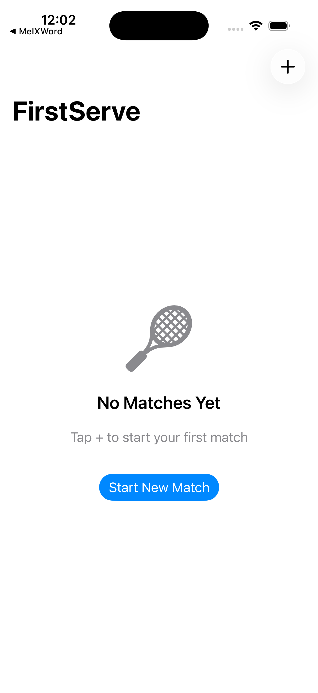

# FirstServe 🎾

A simple, elegant tennis scoring and match tracking app for iOS.



## Features

### ✅ MVP Complete (v1.0)

**Match Management**
- Quick match setup (player names, court surface, best-of-3 or best-of-5)
- Live scoring with proper tennis rules (0-15-30-40-deuce-advantage)
- Tiebreak support (first to 7, win by 2, with serve rotation)
- Full undo functionality to correct scoring mistakes
- Match history with search and filtering

**Player Statistics**
- Track aces, double faults, winners, and unforced errors
- Quick stat buttons during live matches (tap "Ace" to award point + record stat)
- Career win/loss records
- Per-player match history
- Match detail view with set-by-set scores and stats comparison

**Data Persistence**
- SwiftData for local storage
- Match and player data persists across app sessions

### 🚀 Planned Premium Features (Phase 2)

- First serve percentage tracking
- Break point conversion stats
- Head-to-head player records
- Trend graphs over time
- PDF match report export
- iCloud sync across devices
- Apple Watch quick scoring
- Dark mode optimization

## Tech Stack

- **SwiftUI** - Modern declarative UI framework
- **SwiftData** - Apple's persistence framework (iOS 17+)
- **XcodeGen** - Project generation from YAML
- **XCTest** - Unit and UI testing

## Requirements

- iOS 17.0+
- Xcode 16.2+
- Swift 5.9+

## Project Structure

```
FirstServe/
├── FirstServe/
│   ├── Models/          # Core data models (Match, Player, Set, Game)
│   ├── ViewModels/      # Match logic and state management
│   └── Views/           # SwiftUI views
├── FirstServeTests/     # Unit tests (30 tests, all passing)
└── FirstServeUITests/   # UI tests for critical user flows
```

## Building & Running

### Using Xcode

1. Clone the repository
2. Generate the Xcode project:
   ```bash
   xcodegen generate
   ```
3. Open `FirstServe.xcodeproj`
4. Select a simulator (iPhone 16 recommended)
5. Press Cmd+R to build and run

### Running Tests

**Unit Tests:**
```bash
xcodebuild test -scheme FirstServe \
  -destination 'platform=iOS Simulator,name=iPhone 16' \
  -only-testing:FirstServeTests
```

**UI Tests:**
```bash
xcodebuild test -scheme FirstServe \
  -destination 'platform=iOS Simulator,name=iPhone 16' \
  -only-testing:FirstServeUITests
```

## Testing Coverage

### Unit Tests ✅ 30/30 Passing

- **Game Scoring** - Tennis score progression (0, 15, 30, 40, deuce, advantage)
- **Set Logic** - Game wins, set wins, tiebreak conditions
- **Match State** - Best-of-3/5, winner determination, score strings
- **Undo System** - State snapshots and rollback

### UI Tests ✅ 6 Test Cases

1. `testAppLaunchShowsEmptyState` - Verify empty state message on first launch
2. `testCreateNewMatch` - Complete new match flow (names → surface → start)
3. `testScorePointsUpdatesScore` - Point scoring updates display correctly
4. `testCompleteGameSwitchesServer` - Server rotation after game completion
5. `testUndoRestoresPreviousState` - Undo button reverts last point
6. `testCompleteMatchShowsWinner` - Match completion shows winner banner

## Development

### Regenerating the Project

After modifying `project.yml`:
```bash
xcodegen generate
```

### Adding New Features

1. Create feature branch: `git checkout -b feature/your-feature`
2. Add models in `Models/`
3. Add business logic in `ViewModels/`
4. Add UI in `Views/`
5. Write unit tests in `FirstServeTests/`
6. Add UI tests for user flows in `FirstServeUITests/`
7. Test on simulator and record screen demos
8. Commit and push

### Screen Recordings

Use `xcrun simctl io` to record feature demos:
```bash
xcrun simctl io booted recordVideo --codec=h264 demo.mp4
# Use the app
# Press Ctrl+C to stop recording
```

## Contributing

This is a personal project by Cam Frederick. Contributions welcome via pull requests!

## Monetization Plan (Future)

- **Free Tier** - Basic match logging and scores
- **Premium ($2.99/month)** - Advanced stats, trends, head-to-head, export
- **Lifetime ($9.99)** - One-time purchase for all premium features

## License

Copyright © 2026 Cam Frederick. All rights reserved.

---

**Status:** 🟢 MVP Complete - Ready for App Store submission pending premium features and App Store assets (icon, screenshots, description)
